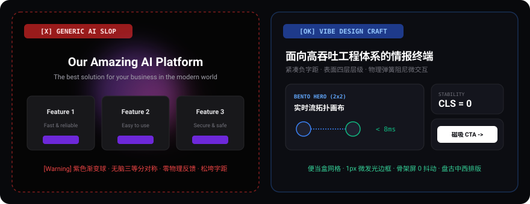
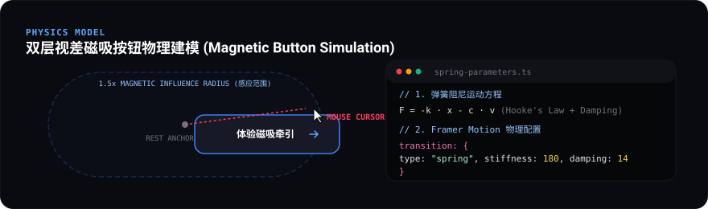

<p align="center">
  
</p>

<div align="center">

[](LICENSE)
[](https://github.com/anthropics/claude-code)
[](https://cursor.com)
[](https://tailwindcss.com)
[](https://motion.dev)
[](https://github.com/shinewinsu/vibe-frontend-design/pulls)

<br />

[ English Documentation ](#english-documentation) &nbsp;|&nbsp; [ 简体中文文档 ](#chinese-documentation)

</div>

---

<a name="chinese"></a>
## 简体中文文档 (Chinese)

### 为什么需要这个 Skill？

在用 AI（Claude Code、Cursor、Windsurf、Codex）写前端时，开发者每天都在忍受以下**“AI 垃圾模板味（AI Slop）”**：
1. **千篇一律的模板审美**：默认的紫色/粉色放射渐变大球、无脑三等分对称卡片、未调整字距的松垮大标题；
2. **只会说模糊形容词**：向 AI 提需求只会输入“帮我做一个高级、有质感、像苹果那样的界面”，AI 只能全凭盲猜；
3. **动效生硬假滑**：所有元素同节奏同时淡入、缺少物理阻尼、点击无按压反馈、折叠菜单生硬跳变；
4. **中文字体排版灾难**：中西文紧贴挤压、标点符号掉落行首、在现代深色界面中排版松散发虚。

**`vibe-frontend-design` 是全网首个融合 X 爆款博主 Adrian Punk（[@AdrianPunk115](https://x.com/AdrianPunk115)）全套视觉与动效词典、GitHub 20 万星顶流前端工程生态（shadcn/ui, Magic UI, Aceternity, react-bits），以及中西文排版美学的模块化 Agent 技能库。**

---

### 视觉与工程对比：普通 AI 生成 vs. 注入本技能

| 维度 | 普通 AI 默认生成 (Generic AI Slop) | **注入 vibe-frontend-design (The Craft)** |
|---|---|---|
| **页面布局** | 单调死板的三等分对称卡片（3-Column Cards） | **错落自适应 Bento Grid（便当盒网格）**，主卡 `col-span-2 row-span-2` |
| **色彩光影** | 纯黑底配刺眼紫色渐变大光斑（Purple Blobs） | **表面四层体系**（Canvas -> Surface -> Overlay），1px 细发光边框，局部光斑跟随 |
| **动效物理** | 所有卡片以相同速度同时淡入，机械无脑 | **交错级联上浮（Stagger 50ms）**，物理弹簧阻尼（`stiffness: 180, damping: 14`） |
| **交互手感** | 按钮点击无任何物理反馈，悬停无张力 | **双层视差磁吸按钮（Magnetic Button）**，点击 `active:scale-[0.98]` |
| **中文字体** | 默认行高拥挤，大标题字间距散漫，标点掉行首 | **1.25 中文字阶黄金律**，大标题负字距（`-0.02em`），中西文盘古之白，标点避头尾 |
| **加载性能** | 全屏突兀白屏，数据返回瞬间布局剧烈抖动 | **1:1 轮廓高光波纹骨架屏（Shimmer）**，纯 CSS 高度自适应手风琴，**CLS = 0** |

<p align="center">
  
</p>

---

### 零安装真实交互效果演示 (Live Interactive Demo)

本项目自带**无需任何构建环境、开箱即用的真实交互演示页面**（`demo/index.html`）：
- **如何打开**：直接双击 `demo/index.html`（或在终端运行 `open demo/index.html` / `start demo/index.html`），在任何现代浏览器中即可零距离体验：
  -  **双层磁吸按钮**：光标靠近产生引力拉扯，文字额外视差位移，移出自然弹簧震荡回弹；
  -  **动态光标聚光灯卡片**：径向渐变微光紧跟鼠标像素坐标流动，激活 1px 细线边框；
  -  **真 3D 透视分层卡片**：随鼠标角度产生真实立体空间倾斜，内部文字按钮 Z 轴悬浮浮出；
  -  **赛博字符解密动画**：鼠标悬停触发黑客终端级字符翻滚解密；
  -  **纯 CSS 零重排手风琴**：点击瞬间 60fps 丝滑展开，解决传统测量 scrollHeight 引起的重排掉帧；
  -  **高光波纹骨架屏**：1:1 复刻最终轮廓，实现 CLS = 0。

```
┌────────────────────────────────────────────────────────────────────────┐
│                   布局结构对比图示 (Visual Layout Comparison)           │
├────────────────────────────────────────────────────────────────────────┤
│ 普通 AI 的无脑对称模板 (The Slop):                                     │
│ ┌───────────┬───────────┬───────────┐                                  │
│ │ Card 1    │ Card 2    │ Card 3    │ (千篇一律，毫无视觉主次与层次)   │
│ └───────────┴───────────┴───────────┘                                  │
│                                                                        │
│ 本技能驱动的 Bento Grid 黄金布局 (The Craft):                          │
│ ┌───────────────────────────────────┬───────────┐                      │
│ │                                   │ Stat 01   │                      │
│ │         HERO ANCHOR TILE          ├───────────┤                      │
│ │         (主角大卡 2x2)            │ Stat 02   │                      │
│ │         核心可视化拓扑流图        ├───────────┴────────────────────┐ │
│ │                                   │ Wide Feature Card              │ │
│ └───────────────────────────────────┴────────────────────────────────┘ │
└────────────────────────────────────────────────────────────────────────┘
```

<p align="center">
  
</p>

---

### 模块化知识库全景 (超过 120 KB 纯干货)

遵循 Anthropic 官方 Skill 规范的**渐进式披露（Progressive Disclosure）**原则，分为主蓝图与 7 本专项参考专著：

```
vibe-frontend-design/
├── SKILL.md                          # 主蓝图：Design Read、三档旋钮系统、Anti-Slop 十大禁令、12 维自检清单
└── references/
    ├── visual-dictionary.md          # 视觉全书：Bento Grid、Split-screen、5 大现代风格、设计令牌
    ├── motion-dictionary.md          # 动效全书：四层动效法则、多层视差 0.3x/1.0x/1.4x、弹簧回弹
    ├── code-recipes.md               # 12 套生产级源码：磁吸按钮、聚光灯卡片、3D 悬停卡、CSS 手风琴
    ├── prompt-cookbook.md            # 提示词任务书：八字段任务书架构、SaaS 官网、作品集完整 Prompt
    ├── chinese-typography.md         # 中文字体排版指南：1.25 中文字阶、盘古之白、大标题紧凑负字距
    ├── archive-aesthetic.md          # 档案美学体系：Knolling 正交网格、漫反射柔光、标本元件化
    ├── design-engineering-qa.md      # 设计工程排错手册：z-index 层叠矩阵、CLS=0 布局防抖、GPU 加速
    └── github-highstar-ecosystem.md  # 20 万星顶流深度解密：shadcn, Magic UI, Aceternity, cmdk, sonner
```

---

### 核心代码配方示例 (Code Showcase)

#### 1. 生产级磁吸按钮（双层视差 + 物理弹簧 + 触屏降级）
> 鼠标在按钮周边 1.5 倍感应区内时，按钮与文字产生双层流体视差位移，移出后弹簧回弹：

```tsx
import React, { useRef, useState } from "react";
import { motion } from "framer-motion";

export function MagneticButton({ children, className = "" }: { children: React.ReactNode; className?: string }) {
  const buttonRef = useRef<HTMLButtonElement>(null);
  const [pos, setPos] = useState({ x: 0, y: 0 });

  const handleMouseMove = (e: React.MouseEvent<HTMLButtonElement>) => {
    if (window.matchMedia("(pointer: coarse)").matches) return; // 触屏安全降级
    if (!buttonRef.current) return;
    const { clientX, clientY } = e;
    const { left, top, width, height } = buttonRef.current.getBoundingClientRect();
    // 0.35 整体阻尼牵引
    setPos({ x: (clientX - (left + width / 2)) * 0.35, y: (clientY - (top + height / 2)) * 0.35 });
  };

  return (
    <motion.button
      ref={buttonRef}
      onMouseMove={handleMouseMove}
      onMouseLeave={() => setPos({ x: 0, y: 0 })}
      animate={{ x: pos.x, y: pos.y }}
      transition={{ type: "spring", stiffness: 180, damping: 14, mass: 0.1 }}
      className={`relative inline-flex items-center justify-center rounded-xl px-6 py-3 select-none active:scale-[0.98] ${className}`}
    >
      <motion.span
        animate={{ x: pos.x * 0.5, y: pos.y * 0.5 }} // 内部文字额外视差位移
        transition={{ type: "spring", stiffness: 220, damping: 16 }}
        className="inline-flex items-center gap-2 pointer-events-none"
      >
        {children}
      </motion.span>
    </motion.button>
  );
}
```

<p align="center">
  
</p>

#### 2. 纯 CSS 零重排高度自适应手风琴 (Zero Layout Thrashing Accordion)
> 彻底告别 JS 测量 `scrollHeight` 导致的页面重排掉帧，基于现代 CSS Grid 实现 60fps 丝滑展开：

```css
.accordion-content {
  display: grid;
  grid-template-rows: 0fr;
  transition: grid-template-rows 250ms cubic-bezier(0.16, 1, 0.3, 1);
}
.accordion-item[data-open="true"] .accordion-content {
  grid-template-rows: 1fr;
}
.accordion-inner {
  overflow: hidden;
}
```

#### 3. 动态光标聚光灯卡片 (Dynamic Spotlight Card)
> 鼠标划过卡片时，局部径向微发光沿着光标流动，赋予 1px 细线边框以呼吸感：

```tsx
import React, { useRef } from "react";

export function SpotlightCard({ children, className = "" }: { children: React.ReactNode; className?: string }) {
  const cardRef = useRef<HTMLDivElement>(null);

  const handleMouseMove = (e: React.MouseEvent<HTMLDivElement>) => {
    if (!cardRef.current) return;
    const rect = cardRef.current.getBoundingClientRect();
    cardRef.current.style.setProperty("--mouse-x", `${e.clientX - rect.left}px`);
    cardRef.current.style.setProperty("--mouse-y", `${e.clientY - rect.top}px`);
  };

  return (
    <div
      ref={cardRef}
      onMouseMove={handleMouseMove}
      className={`group relative rounded-2xl bg-zinc-900/60 p-6 border border-white/10 overflow-hidden ${className}`}
    >
      <div
        className="pointer-events-none absolute -inset-px rounded-2xl opacity-0 transition-opacity duration-300 group-hover:opacity-100"
        style={{
          background: "radial-gradient(450px circle at var(--mouse-x, 0) var(--mouse-y, 0), rgba(255, 255, 255, 0.08), transparent 80%)",
        }}
      />
      <div className="relative z-10">{children}</div>
    </div>
  );
}
```

---

###  八字段任务书实战范式 (Prompt Specification in Action)

当你让 AI 编写一个落地页时，不要只说“写个好看的网页”，而是套用本 Skill 独家的**八字段任务书框架**：

```markdown
# 1. 角色 (Role): 兼任资深信息架构师与高阶前端设计工程师。
# 2. 目标 (Goal): 为分布式 AI 监控平台构建高转化官网首屏，核心转化为点击“开始免费接入”。
# 3. 受众 (Audience): 追求高信噪比的全栈工程师与架构师，桌面宽屏查阅为主。
# 4. 页面 (Pages): 单页 Landing Page (Hero -> Social Proof 跑马灯 -> Bento Features -> Pricing -> FAQ)。
# 5. 架构 (IA): F 型视觉动线，左侧痛点价值阐述，右侧交互式终端运行 Canvas。
# 6. 视觉 (Design System): Linear 暗调科技风 (底色 #08090C，表面 #111218，1px 发光边框)，字阶 1.25，紧凑负字距。
# 7. 交互 (Interactions): 主按钮磁吸回弹，Bento 卡片聚光灯跟随，FAQ 手风琴 CSS Grid 展开。
# 8. 验收 (Acceptance): 390px 移动端零横向溢出，键盘聚焦高亮轮廓，适配 prefers-reduced-motion。
```

**AI 接收后将自动执行**：
1. 输出一行 **`Design Read`** 与 **`Three Dials`** 进行基调锁定；
2. 自动屏蔽 AI 紫色光斑等模板套话；
3. 从 `references/code-recipes.md` 提取经过数学验证的组件源码并高质量交付。

---

###  极速安装与使用指南

#### 1. 在 Claude Code 中全局使用（推荐）
```bash
mkdir -p ~/.claude/skills
git clone https://github.com/shinewinsu/vibe-frontend-design.git ~/.claude/skills/vibe-frontend-design
```

#### 2. 在具体前端项目中单仓生效
```bash
mkdir -p .claude/skills
git clone https://github.com/shinewinsu/vibe-frontend-design.git .claude/skills/vibe-frontend-design
```

#### 3. 在终端中随时调用
在 Claude Code 终端中输入：
```bash
/vibe-frontend-design
```
或直接在 Prompt 中要求：
> “**调用 vibe-frontend-design 技能**，参考 `prompt-cookbook.md` 中的任务书框架，为我设计一个 [AI 开发者落地页首屏]。”

---

<a name="english"></a>
## English Documentation

### What is vibe-frontend-design?

When building web frontends with AI coding assistants (Claude Code, Cursor, Windsurf, Codex), developers constantly struggle with **"AI Slop"**:
- Identical generic aesthetics (pitch-black backgrounds with purple/magenta glowing mesh blobs).
- Predictable 3-column symmetrical feature grids.
- Lack of tactile physical feedback (missing button active states, rigid modal transitions).
- Disorganized typography without optical tracking or hierarchy.

**`vibe-frontend-design` is a comprehensive, production-grade Design Engineering Skill.**  
It fuses Adrian Punk's acclaimed visual and motion dictionaries, GitHub's top-tier open-source design systems (shadcn/ui, Magic UI, Aceternity UI, react-bits), and tactile micro-interaction physics into an executable, modular knowledge base.

---

### The Three Dials Configuration
Before generating any code, the agent infers and locks three baseline dials:
- **`DESIGN_VARIANCE` (1 - 10)**: 1 = Strict Symmetry -> 10 = Asymmetric / Expressive Artwork
- **`MOTION_INTENSITY` (1 - 10)**: 1 = Clean Static -> 10 = Cinematic Physics & Multi-layer Parallax
- **`VISUAL_DENSITY` (1 - 10)**: 1 = Airy Gallery Spacing -> 10 = Mission-Critical Dashboard

---

### Live Interactive Demo (Zero-Dependency)

The repository includes a standalone interactive showcase page (`demo/index.html`):
- **How to run**: Simply double-click `demo/index.html` or run `open demo/index.html` in your terminal to interact with all the physical effects in real time:
  -  **Double-Layer Magnetic Button**: Real spring physics pulling both the button and inner text with differential parallax.
  -  **Dynamic Cursor Spotlight**: Real-time radial gradient tracking mouse coordinates.
  -  **3D Perspective Tilt Card**: True 3D elevation along the Z-axis (`translateZ`).
  -  **Decrypted / Scramble Text**: Cyberpunk character rolling on hover.
  -  **Pure CSS Zero-Layout-Thrashing Accordion**: 60fps smooth grid expansion without JS `scrollHeight` reflows.
  -  **Shimmer Skeleton Screen**: 1:1 blueprint outline with zero CLS.

<p align="center">
  
</p>

---

### Modular Knowledge Base Index

- [`SKILL.md`](SKILL.md) — The Master Execution Blueprint: Design Read, Three Dials, Anti-Slop 10 Prohibitions, 12-point QA matrix.
- [`references/visual-dictionary.md`](references/visual-dictionary.md) — Bento Grid rules, Split-screen patterns, 5 modern aesthetic systems, surface level tokens.
- [`references/motion-dictionary.md`](references/motion-dictionary.md) — 4-layer motion framework, stagger intervals (50ms), parallax differential rates (0.3x/1.0x/1.4x), FLIP reordering.
- [`references/code-recipes.md`](references/code-recipes.md) — 12 battle-tested React + Tailwind + Framer Motion components (Magnetic buttons, 3D cards, CSS Grid accordions).
- [`references/prompt-cookbook.md`](references/prompt-cookbook.md) — The 8-Field Mini-Spec Prompt Architecture for SaaS landing pages and developer portfolios.
- [`references/chinese-typography.md`](references/chinese-typography.md) — CJK typography standards, modular font scales, Pangu spacing, optical negative tracking.
- [`references/archive-aesthetic.md`](references/archive-aesthetic.md) — Kimi Archive & Knolling system: Swiss grids, diffuse softbox lighting, museum curation.
- [`references/design-engineering-qa.md`](references/design-engineering-qa.md) — CSS `z-index` stacking context matrix, zero-CLS layout stability, GPU compositing checks.
- [`references/github-highstar-ecosystem.md`](references/github-highstar-ecosystem.md) — Architectural deep-dive into shadcn/ui, Magic UI, Aceternity, and cmdk.

---

### Quick Code Snippet: Double-Layer Magnetic Button

```tsx
import React, { useRef, useState } from "react";
import { motion } from "framer-motion";

export function MagneticButton({ children, className = "" }: { children: React.ReactNode; className?: string }) {
  const buttonRef = useRef<HTMLButtonElement>(null);
  const [pos, setPos] = useState({ x: 0, y: 0 });

  const handleMouseMove = (e: React.MouseEvent<HTMLButtonElement>) => {
    if (window.matchMedia("(pointer: coarse)").matches) return; // Touchscreen fallback
    if (!buttonRef.current) return;
    const { clientX, clientY } = e;
    const { left, top, width, height } = buttonRef.current.getBoundingClientRect();
    // 0.35 spring damping attraction
    setPos({ x: (clientX - (left + width / 2)) * 0.35, y: (clientY - (top + height / 2)) * 0.35 });
  };

  return (
    <motion.button
      ref={buttonRef}
      onMouseMove={handleMouseMove}
      onMouseLeave={() => setPos({ x: 0, y: 0 })}
      animate={{ x: pos.x, y: pos.y }}
      transition={{ type: "spring", stiffness: 180, damping: 14, mass: 0.1 }}
      className={`relative inline-flex items-center justify-center rounded-xl px-6 py-3 select-none active:scale-[0.98] ${className}`}
    >
      <motion.span
        animate={{ x: pos.x * 0.5, y: pos.y * 0.5 }} // Inner text parallax
        transition={{ type: "spring", stiffness: 220, damping: 16 }}
        className="inline-flex items-center gap-2 pointer-events-none"
      >
        {children}
      </motion.span>
    </motion.button>
  );
}
```

---

<a name="credits"></a>
## 致谢与灵感来源 (Credits & Inspirations) (Credits & Inspirations)

本项目深受以下顶尖创作者与开源先锋的深刻启发：

- **特别致谢：[Adrian Punk (@AdrianPunk115)](https://x.com/AdrianPunk115)**  
  本技能的核心词典与任务书体系深受其 X 爆款长文《Vibe Coding 视觉词典》、《Vibe Coding 网页动效词典》、《2026 中文字体 AI 提示词指南》与《Kimi Archive 档案美学体系》的深刻启发。
- **[Leonxlnx/taste-skill](https://github.com/Leonxlnx/taste-skill)**：感谢其首创的 Anti-Slop 理念、Design Read 与三档旋钮系统。
- **[shadcn/ui](https://github.com/shadcn-ui/ui)** & **[Radix UI](https://github.com/radix-ui/primitives)**：无样式可访问性基石。
- **[magicuidesign/magicui](https://github.com/magicuidesign/magicui)** & **[aceternity/ui](https://github.com/aceternity/ui)**：现代微动效与震撼视觉呈现。
- **[DavidHDev/react-bits](https://github.com/DavidHDev/react-bits)**：丰富的创意动画与文本解密动效。
- **[Emil Kowalski](https://emilkowal.ski/)** ([animations.dev](https://animations.dev/), [sonner](https://github.com/emilkowalski/sonner), [vaul](https://github.com/emilkowalski/vaul)) 与 **[Paco Coursey](https://paco.me/)** ([cmdk](https://github.com/pacocoursey/cmdk))：手艺级交互设计工程学的布道者。
- **[ibelick](https://github.com/ibelick)**：质感底纹与噪点美学启发。

---

## 开源许可证 (License) (License)

本项目采用 [MIT License](LICENSE) 开源。欢迎 Star、Fork、提 PR 或在社区中自由分享！
